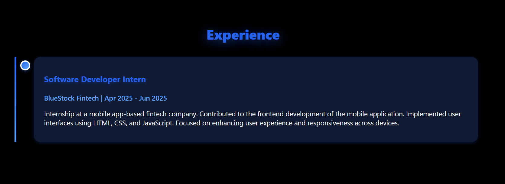
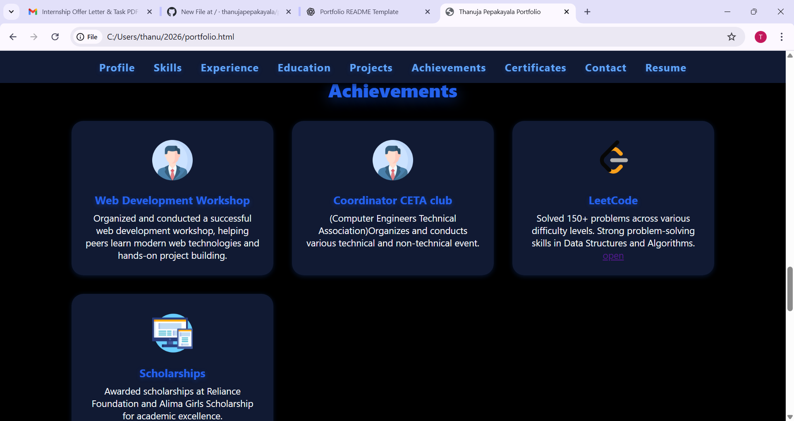
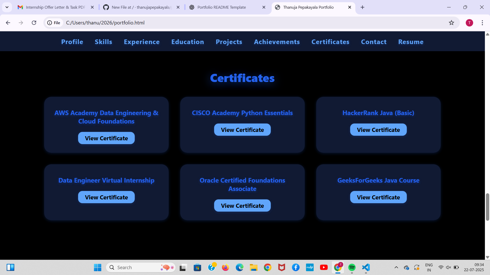
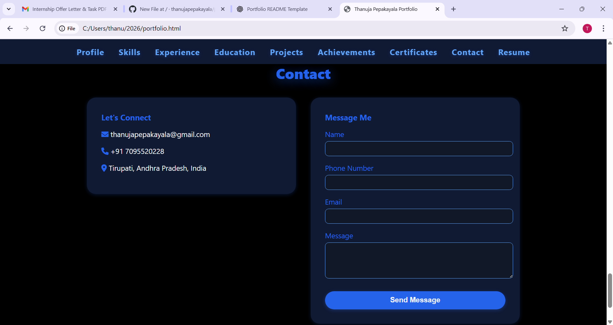

# 💼 Thanuja Pepakayala - Developer Portfolio

Welcome to my personal portfolio website! This project highlights my background, skills, projects, and achievements as a **Java Developer** and **Computer Science student**.

This portfolio is built using **HTML**, **CSS**, and **JavaScript**, with custom styling for an elegant and responsive design.

---

## 🚀 Live Preview

You can view the live portfolio here:  
🔗 [https://yourusername.github.io/your-repo-name](https://yourusername.github.io/your-repo-name)  
*(Replace with your actual GitHub Pages URL)*

---

## 🧰 Tech Stack

- **Frontend**: HTML5, CSS3, JavaScript  
- **Icons & Fonts**: Font Awesome  
- **Responsive Design**: CSS Flex/Grid, media queries  
- **Deployment**: GitHub Pages / Localhost

---

## 📚 Sections Included

- **Profile**: Summary of background and interests  
- **Skills**: Technical and soft skills visualized in grid format  
- **Experience**: Internship at BlueStock Fintech  
- **Education**: Academic journey and performance  
- **Projects**: Portfolio and Forum Website  
- **Achievements**: Competitions, workshops, and clubs  
- **Certificates**: Professional certifications f# 💼 Thanuja Pepakayala - Developer Portfolio

Welcome to my personal portfolio website! This project highlights my background, skills, projects, and achievements as a **Java Developer** and **Computer Science student**.

This portfolio is built using **HTML**, **CSS**, and **JavaScript**, with custom styling for an elegant and responsive design.

---

## 🚀 Live Preview

You can view the live portfolio here:  
🔗 [https://yourusername.github.io/your-repo-name](https://yourusername.github.io/your-repo-name)  
*(Replace with your actual GitHub Pages URL)*

---

## 🧰 Tech Stack

- **Frontend**: HTML5, CSS3, JavaScript  
- **Icons & Fonts**: Font Awesome  
- **Responsive Design**: CSS Flex/Grid, media queries  
- **Deployment**: GitHub Pages / Localhost

---

## 📚 Sections Included

- **Profile**: Summary of background and interests  
- **Skills**: Technical and soft skills visualized in grid format  
- **Experience**: Internship at BlueStock Fintech  
- **Education**: Academic journey and performance  
- **Projects**: Portfolio and Forum Website  
- **Achievements**: Competitions, workshops, and clubs  
- **Certificates**: Professional certifications from AWS, HackerRank, Oracle, etc.  
- **Contact**: Form and direct links (email, phone, LinkedIn, GitHub)

---

## 🖼️ Screenshots

Add some screenshots of your portfolio sections here (optional).  
You can use ``
``
 ``
 ``
  ``
---

## 📦 Installation

To run this portfolio locally:


git clone https://github.com/yourusername/your-repo-name.git
cd your-repo-name
open portfolio.html
rom AWS, HackerRank, Oracle, etc.  
- **Contact**: Form and direct links (email, phone, LinkedIn, GitHub)

---

## 🖼️ Screenshots






---

## 📦 Installation

To run this portfolio locally:

```bash
git clone https://github.com/yourusername/your-repo-name.git
cd your-repo-name
open portfolio.html
